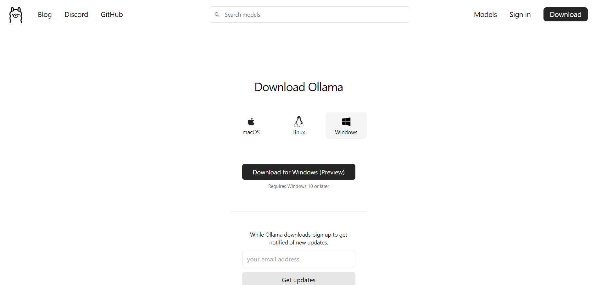

# Get to Meet Phi-3
&emsp; To use this program, you two options for setting up your environment. First, you can create a virtual environment from the connect requirements.yaml file. Importing this file into a virtual environment will install all of the necessary dependencies for running the program. You can do this process by entering  __conda create --name my_yaml_env --file requirement.yaml__ into a command line. This command will create a virtual environment named 'my_yaml_env' - you can change the name of it by editing the prompt above. Once the virtual environment is created, you should be ready to run the program.

&emsp; Second, if the yaml file does not work or you do not have conda installed on your machine, you can also the step below to manual install the necessary packages for the program. These steps will guide you through downloading ollama from the web, installing Phi-3 from ollama, and all related packages. It is a simple process that will only take a couple of minutes. Both processes listed above will have the same end result, the only difference is the way the dependencies are installed.

## Installing Ollama
&emsp; Go to [Ollama's website](https://ollama.com/download) and download the correct installer for your operating system. Navigate through the installer until it finishes installing. This process may take a few minutes, so not to worry if it runs slow.

### Pull Phi-3 from Ollama
&emsp; Once Ollama has finished installing on your computer, open a command line (Command Prompt, Terminal, PowerShell, etc) and enter the following command: __ollama pull phi3__ . This process pulls Phi-3 from Ollama's repository and allows the model to run on your local machine. Since the model is on your local machine, you do not need to rely on Microsoft's or Ollama's servers to talk to the model.

### Install Ollama Package in Python
&emsp; Lastly, you will need to install the python package for Ollama. In your command line, type: __pip install ollama__. This command will install the ollama library for use in python files. It gives you access to the **Import Ollama** command. After this step, you will be all ready to run Phi-3 in your command line or in python code!

## Running The Program
&emsp; After everything is installed, Phi-3 is ready to use! To use the model in your command line, enter the following command: __ollama run phi3__ Your command line should change into a input line to talk to Phi-3. It will show three left arrows >>>. Any input you enter from here will be asked to Phi-3, and it will respond with the best answer it can provide. 

&emsp; To use the software attached to this README, you will already have everything necessary to run it on your computer if you have followed the steps above. To see to software work, click to run button and watch the Phi-3 model respond to the three prompts. The sll.py file will read in the contents of the input1.txt file. This file has three prompts:  1. What is your name? 2. Who trained you? 3. Am I your friend? please do not say no, I really like you. The model reads in these prompts and then posts its response in the output1.txt file. This program can also be easily modified to recieve user input. Feel free to use this code for your own use project if a segement of it seems useful for your tasks.
